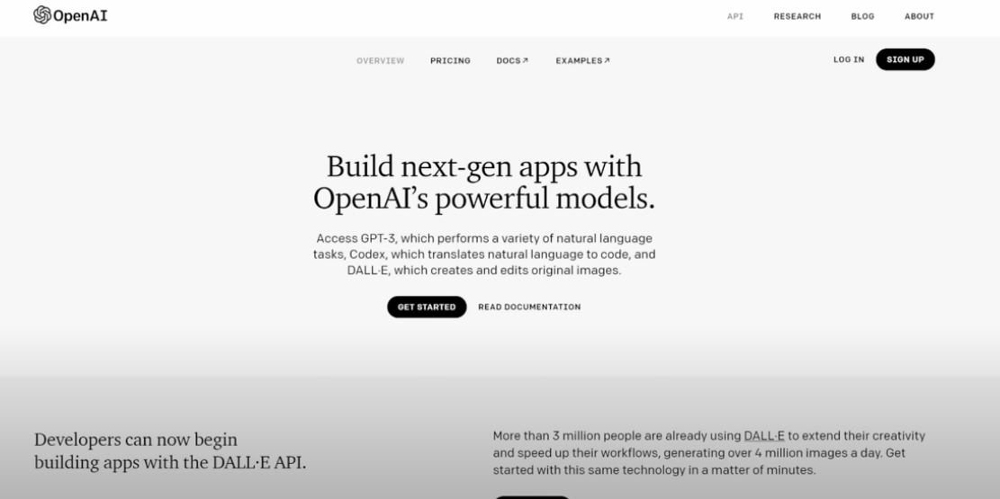
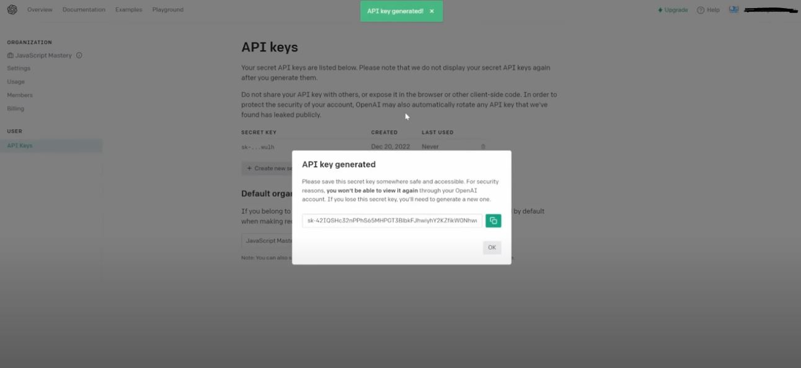
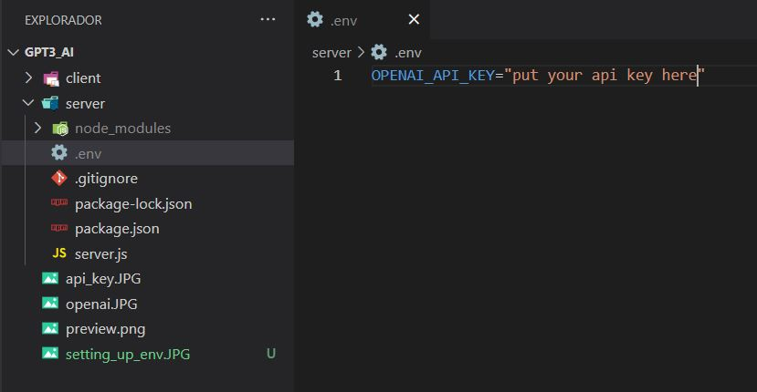

# GPT3 AI Chat Clone

This project is a clone of the chat GPT3 AI.

## Preview

The image below is not a complete preview that you are going to see in this project, because I only created the chat itself.

## How do I run this project?

Before you download the project, you will have to have your own API key to run the chat. Go to [Open AI](https://openai.com/api/) and create your own account. 

Then click on your profile picture and then [view API keys](https://beta.openai.com/account/api-keys) and generate your own key.

After that, go to the project files and in the server directory create a new .env file and add your API key on it.

Then you can run the following commands on your terminal:
- __cd server__
- __npm install nodemon__
- __npm nodemon__
- __cd client__
- __npm install__
- __npm run dev__
